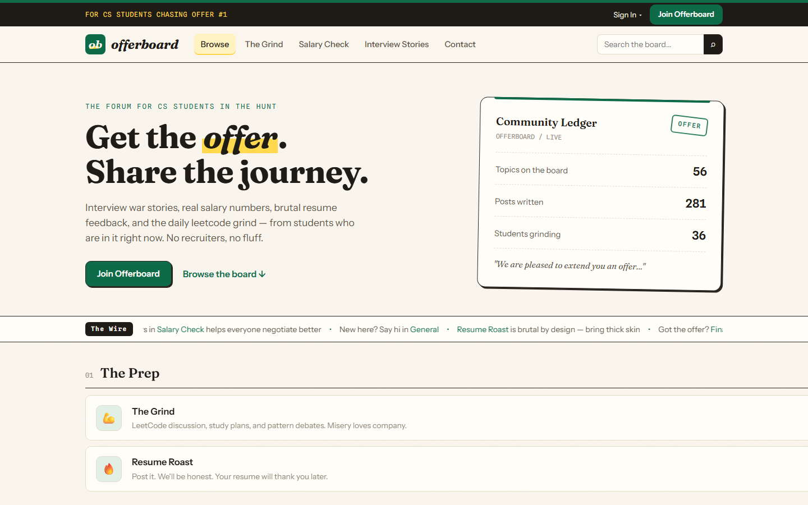
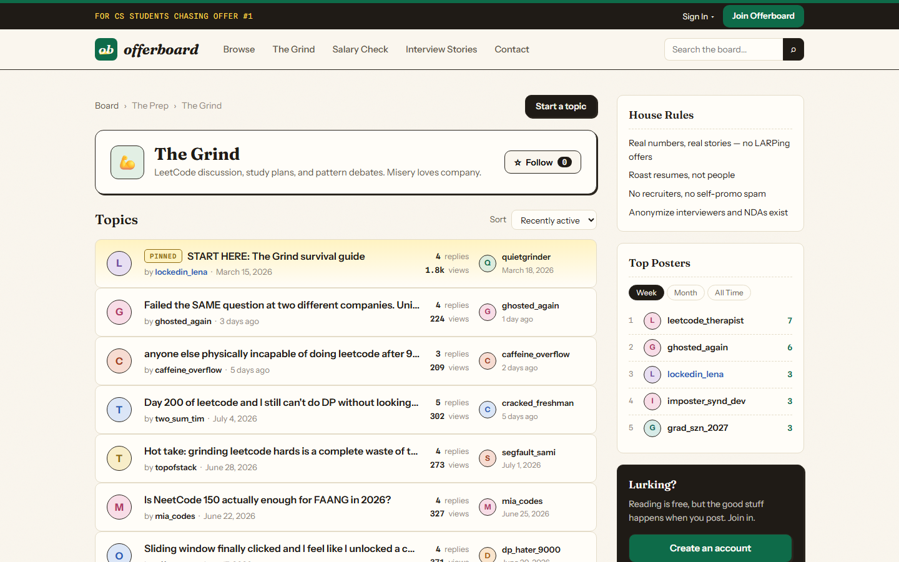
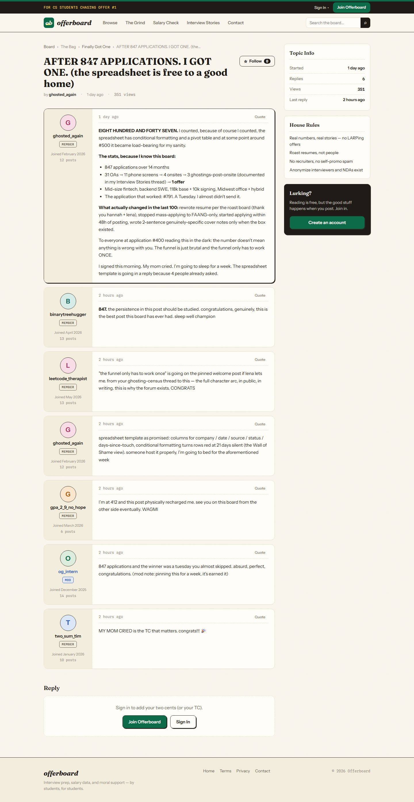
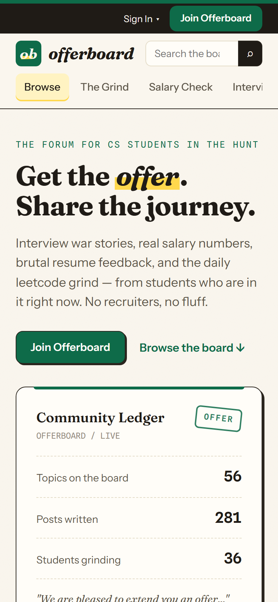

<div align="center">


# Offerboard

**The forum for CS students chasing offer #1.**

Interview war stories · real salary numbers · resume roasts · the leetcode grind

**[Live site →](https://offerboard-kappa.vercel.app)**

</div>



## What is this?

Offerboard is a community forum where CS students trade the things that actually get you hired: real interview questions, real compensation numbers, honest company reviews, and brutal-but-kind resume feedback. Think Blind × Reddit, scoped to people hunting their first internship or new grad offer.

It's also a deliberate engineering exercise: a full product — auth, roles, moderation, search, live presence — built with **zero frameworks and zero build step**. Every line of frontend is hand-written HTML, CSS, and vanilla JavaScript. The entire backend is Postgres, doing what Postgres does best.

## Why vanilla?

Because the constraint is the point. No React means no escape hatch into `npm install` when something gets hard — pagination, XSS-safe markdown rendering, optimistic UI, and component reuse all had to be solved directly. The result is a codebase where every behavior is traceable to code I wrote, the entire JS payload is a few small files, and "how does this work?" always has a real answer.

## Tech stack

| Layer | Choice | Why |
|---|---|---|
| Frontend | Vanilla HTML/CSS/JS | No build step, no dependencies, full traceability |
| Backend | [Supabase](https://supabase.com) (Postgres) | Auth, RLS, triggers, views, RPCs — the database *is* the backend |
| Auth | Supabase Auth | Email/password with verification, session persistence |
| Hosting | Vercel | Static hosting, auto-deploy on push, security headers via `vercel.json` |
| Type | Fraunces · Instrument Sans · Spline Sans Mono | The "offer letter" design system |

## Architecture

```
┌─────────────────────────────────────────────┐
│  Static pages (Vercel)                      │
│                                             │
│  layout.js   shared chrome, injected once   │
│  render.js   escaping + markdown-lite       │
│  forum.js    page logic                     │
│      │                                      │
│      ▼                                      │
│  forum-api.js  ◄── every query goes         │
│      │             through this one file    │
└──────┼──────────────────────────────────────┘
       ▼
┌─────────────────────────────────────────────┐
│  Supabase (Postgres)                        │
│                                             │
│  RLS policies      who sees/writes what     │
│  Triggers          denormalized counters,   │
│                    profile auto-creation    │
│  Views             joined reads (invoker    │
│                    security, RLS applies)   │
│  RPCs              moderation, search,      │
│                    presence, follows        │
└─────────────────────────────────────────────┘
```

Two decisions carry the design:

1. **All data access lives in `js/forum-api.js`.** Pages never touch the Supabase client directly. That single seam is deliberate — a caching layer ([goredis](#roadmap), a Redis clone in Go) will slot in front of these reads without touching any UI code.
2. **Authorization lives in the database, not the client.** The UI hides buttons; Row Level Security enforces reality. Client-side checks are UX, RLS is the law.

## The role system

`guest → member → moderator → admin`, enforced end to end:

- **Guests** read everything public; every write path prompts sign-up.
- **Members** post, reply, quote, and follow — unless banned (enforced by RLS `INSERT` policies, not just UI).
- **Moderators** pin, lock, soft-delete, warn (3 warnings = automatic ban), and ban — but *cannot* touch admins or each other, enforced by a `SECURITY DEFINER` guard in Postgres.
- **Admins** manage roles from the mod panel. Members can't self-promote: the profile-update policy checks the role column against the caller's current role.

This isn't aspirational — a verification suite signs in as a real member and attempts 17 privilege escalations (self-promotion, forging authorship, reading the mod log, posting into staff-only categories, banning a moderator...). All 17 fail at the database layer.

## Security notes

- **Stored XSS is structurally prevented.** Post content is plain text with markdown-lite markers; it only reaches the DOM through a renderer that escapes *everything* first, then applies formatting. Link hrefs are restricted to `http(s)`.
- **The publishable key in the client is by design.** It grants only what RLS allows — that's the Supabase security model. The secret key exists solely in a gitignored `.env` used by the seed script.
- **`SECURITY DEFINER` functions pin `search_path`** to block schema-shadowing attacks, and views run with `security_invoker` so RLS applies to the reader, not the definer.
- **CSP + frame-denial headers** ship via `vercel.json`.

## Screenshots

| Category view | Thread |
|---|---|
|  |  |



## Run it locally

```bash
git clone https://github.com/aghanem007/offerboard.git
cd offerboard
python -m http.server 3000   # any static server; auth needs a real origin, not file://
# open http://localhost:3000
```

To point at your own database: create a Supabase project, run `db/schema.sql` in the SQL Editor (one idempotent script — tables, RLS, triggers, views, RPCs, grants, seed categories), and swap the URL + publishable key at the top of `js/supabase-config.js`.

### Seeding the board

The forum ships with a seeder that populates 35 users with distinct personas, ~60 topics, and ~230 replies of hand-written content — comp threads with plausible numbers, interview post-mortems, company reviews — backdated across four months so the board looks lived-in from day one.

```bash
cd scripts/seed
cp .env.example .env    # fill in your project URL + secret key
npm install
npm run seed            # idempotent: wipes and rebuilds its own data
```

## Roadmap

- **goredis** — a Redis clone in Go, built from scratch, then wired in as Offerboard's caching layer behind `forum-api.js`. That's phase two of this project, and the reason the data layer is a single seam.
- Custom SMTP (branded auth emails) and GitHub OAuth.
- Notifications for followed topics.

## License

MIT — read it, fork it, roast it.
